# Лабораторна робота №2

## "Робота з package.json, залежностями, змінними оточення, семантичним версіонуванням, базовими можливостями TypeScript (type, interface, class)."

### Дисципліна: _Конструювання ПЗ_

### Виконав: _Биков Віктор з групи ІПЗ 3.03_

---

## Опис проекту

Це навчальний TypeScript-проект, створений для демонстрації:

- Основ роботи з `package.json` та управління залежностями.
- Використання змінних оточення для конфігурації проекту.
- Основ семантичного версіонування для управління версіями проекту в процесі його розвитку.

---

## Інструкції з запуску

```bash
# Клонування репозиторію
git clone https://github.com/LordMaska/KPZ_2lb.git
cd KPZ_2lb

# Встановлення залежностей
npm install

# Запуск демонстраційного коду
npm run demo

# Перевірка типів, лінтингу та форматування
npm run typecheck
npm run lint
npm run format:check

# Форматування (за потреби)
npm run format

# Збірка бібліотеки
npm run build
```

---

## Структура проекту

```
├─ src/
│  ├─ index.ts       ← точка входу бібліотеки
│  ├─ demo.ts        ← приклади викликів (помилки → виправлення)
│  └─ config.ts      ← зчитування .env + валідація через zod
├─ .env              ← локальний, у .gitignore
├─ .gitignore
├─ package.json
├─ tsconfig.json
├─ eslint.config.cjs
├─ .prettierrc.cjs
├─ commitlint.config.cjs
├─ .husky/
│   ├─ pre-commit
│   └─ commit-msg
└─ dist/ (створюється після npm run build)
```

---

## Історія версій

| Версія                                                                | Основні зміни                                                        | Зворотня сумісність |
| :-------------------------------------------------------------------- | :------------------------------------------------------------------- | :------------------ |
| [**0.1.0**](https://github.com/LordMaska/KPZ_2lb/releases/tag/v0.1.0) | Базова структура проєкту, функції `add`, `capitalize` з типом `any`. | ✅                  |
| [**0.2.0**](https://github.com/LordMaska/KPZ_2lb/releases/tag/v0.2.0) | Додано до функцій базову типізацію.                                  | ✅                  |
| [**0.3.0**](https://github.com/LordMaska/KPZ_2lb/releases/tag/v0.3.0) | Додано функцію `formatNumber` зі складним типом.                     | ✅                  |
| [**0.4.0**](https://github.com/LordMaska/KPZ_2lb/releases/tag/v0.4.0) | Додано інтерфейси + функцію `groupBy<T>`.                            | ✅                  |
| [**0.5.0**](https://github.com/LordMaska/KPZ_2lb/releases/tag/v0.5.0) | Додано клас `Logger` та змінні оточення.                             | ✅                  |
| [**1.0.0**](https://github.com/LordMaska/KPZ_2lb/releases/tag/v1.0.0) | Впровадження суворої типізації та стабілізація API                   | ✅                  |
| [**2.0.0**](https://github.com/LordMaska/KPZ_2lb/releases/tag/v2.0.0) | **BREAKING CHANGE** Функція `add` від нині приймає масив `number[]`. | ❌                  |

---

## Приклад використання

```typescript
import { add, capitalize, formatNumber, Logger } from './dist/index.js';

// Використання функції add
const sum = add([1, 2, 3, 4]);
console.log(`Сума: ${sum}`); // Сума: 10

// Використання функції capitalize
const capitalized = capitalize('hello world');
console.log(`Капіталізоване: ${capitalized}`); // Капіталізоване: Hello world

// Використання функції formatNumber
const formattedNumber = formatNumber(1234.5678, {
  minimumFractionDigits: 2,
  maximumFractionDigits: 2,
});
console.log(`Відформатоване число: ${formattedNumber}`); // Відформатоване число: 1,234.57

// Використання класу Logger
const logger = new Logger('debug');
logger.info('Це інформаційне повідомлення.');
```

---

## Змінні середовища (.env):

```bash
APP_PRECISION=3 <-вказуєте точність форматування чисел для formatNumber()
LOG_LEVEL=debug <-рівень логування (silent, info, debug) у класі Logger
```

---

## Тестування

Тестування кожної версії відбувалась у файлі `src/demo.ts`, де спершу навмисне спостерігалось відслідковування помилок, а потім функціонування у виправленій версії.
Тестування виконувалось за допомогою команд:

```bash
npm run typecheck
npm run lint
npm run format:check
```

Аналогічна перевірка виконується перед кожною публікацією оновлення у репозиторії і при виявленні помилок публікація автоматично блокується.

---

## Хід лабораторної роботи:

**v.0.0.0**

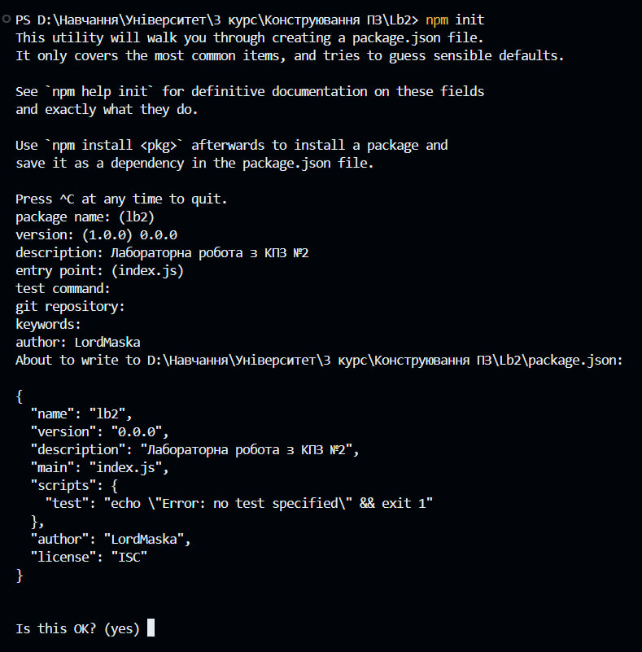

---

**v.0.1.0**

_З навмисною помилкою:_

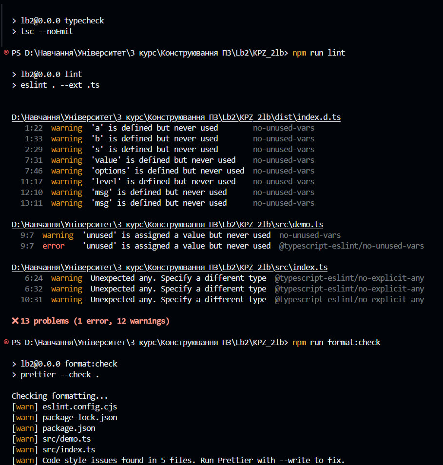

_Після виправлення:_

## 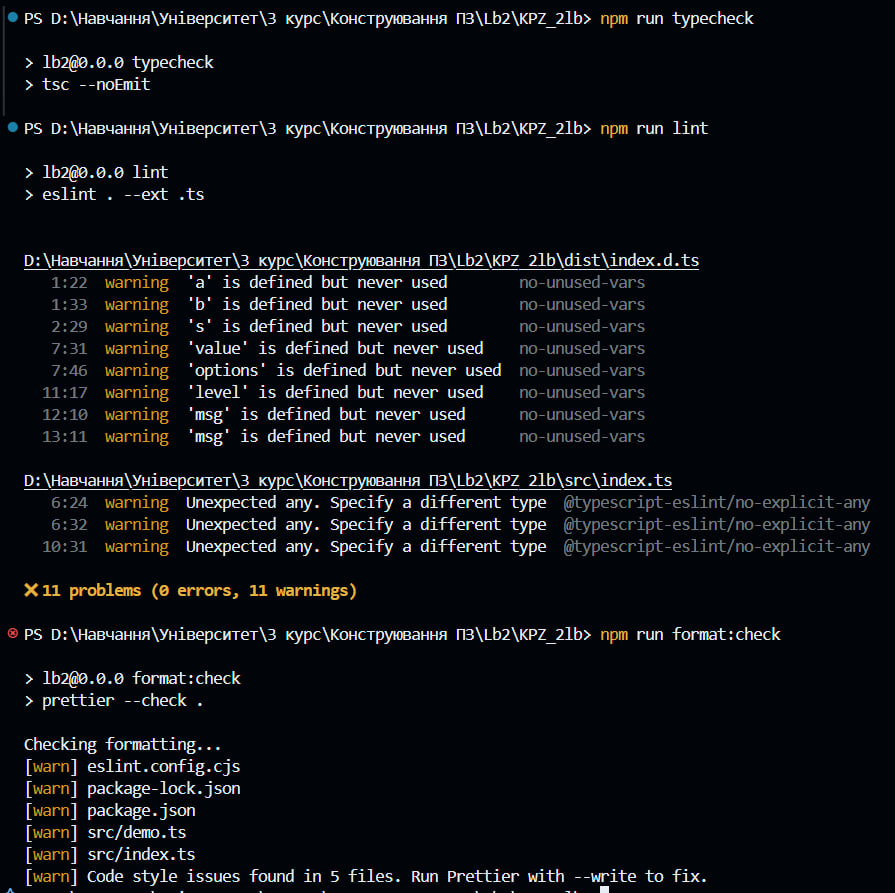

**v.0.2.0**

_З навмисною помилкою:_

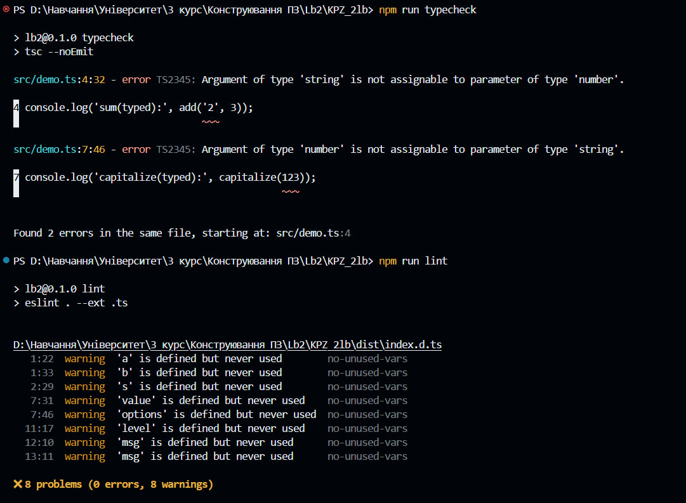

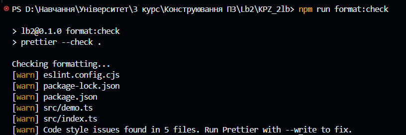

_Після виправлення:_

## 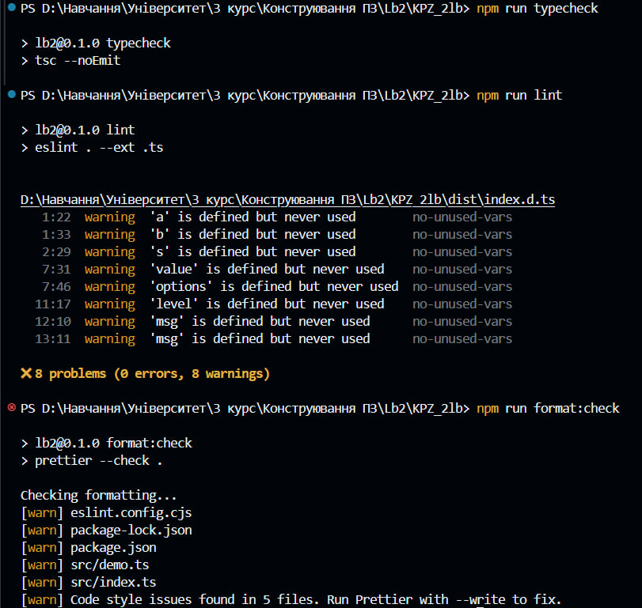

**v.0.3.0**

_З навмисною помилкою:_

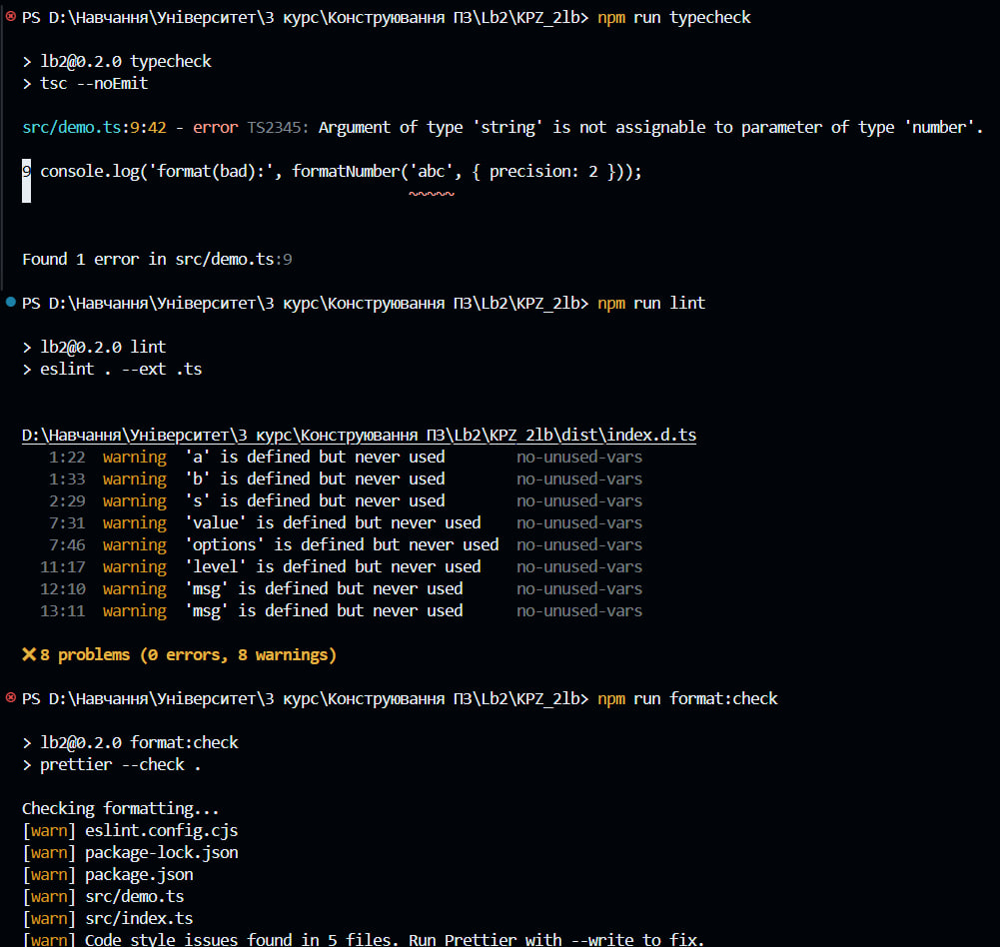

_Після виправлення:_

## 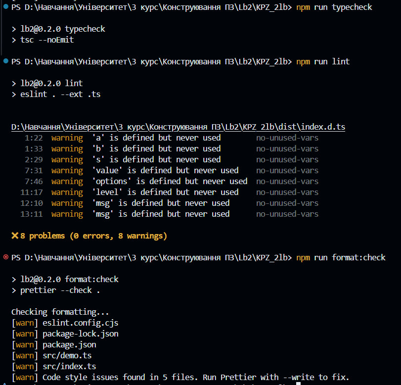

**v.0.4.0**

_З навмисною помилкою:_

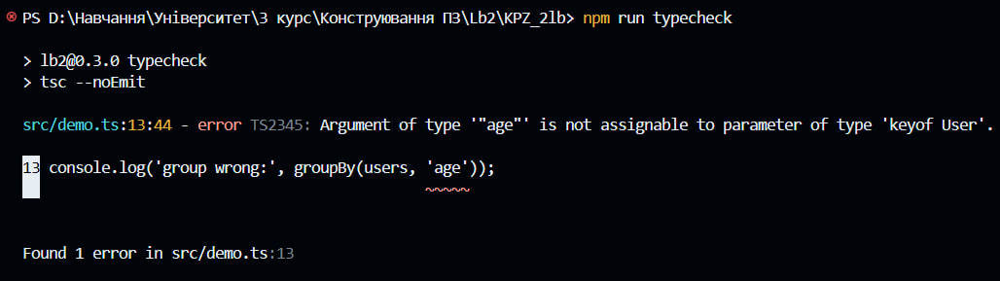

_Після виправлення:_

## 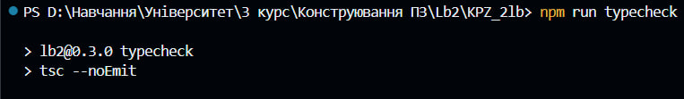

**v.0.5.0**

_З навмисною помилкою:_

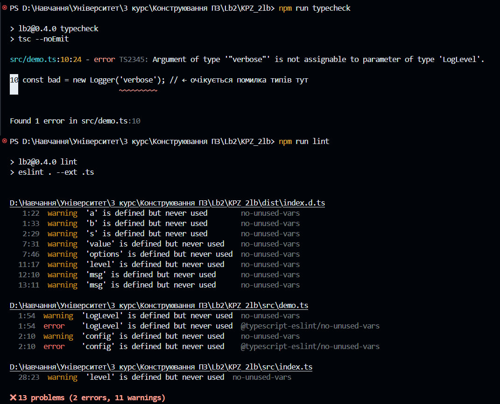

_Після виправлення:_

## 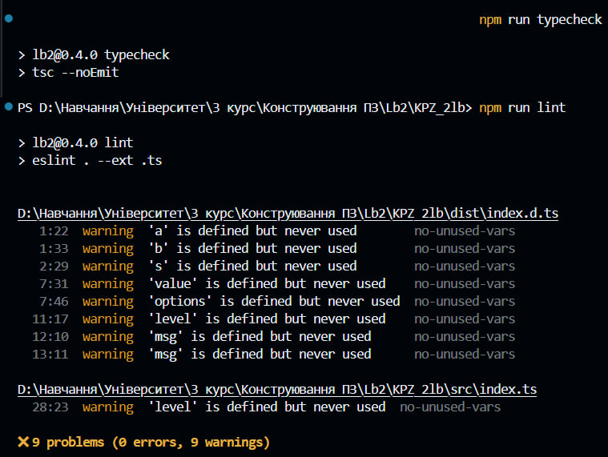

**v.1.0.0**

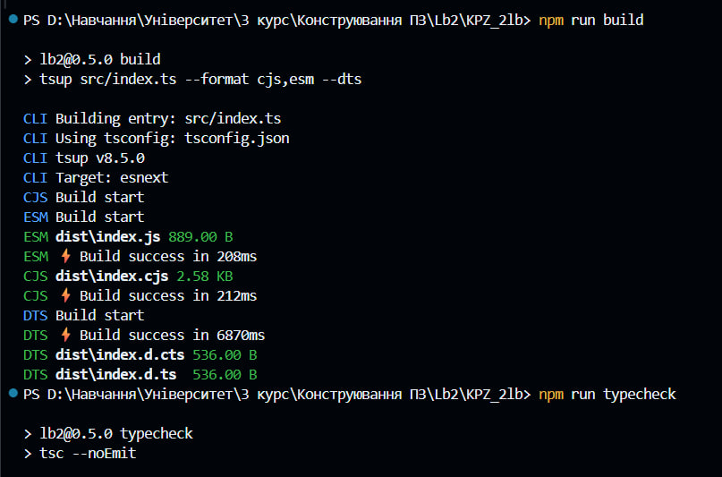

## 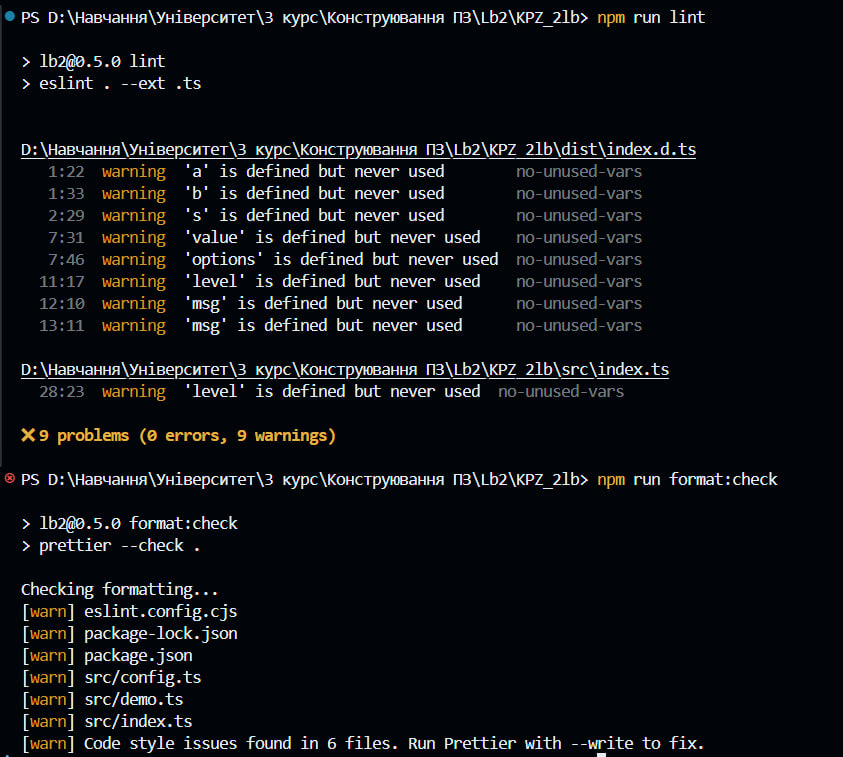

**v.2.0.0**

_З навмисною помилкою:_

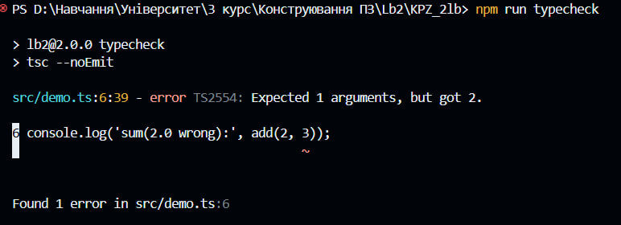

_Після виправлення:_

## 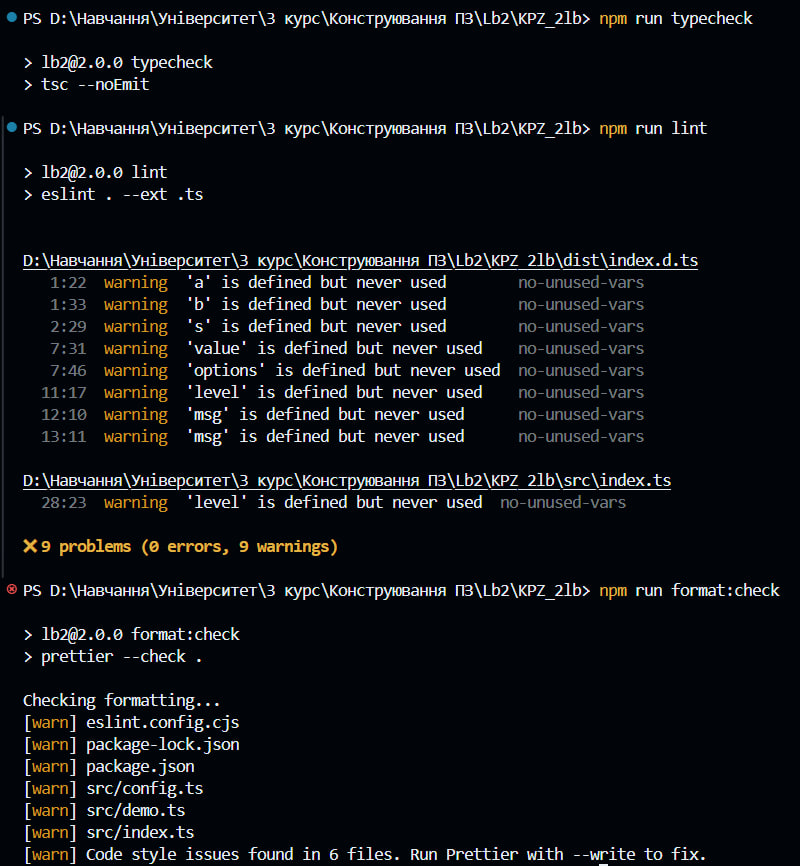
